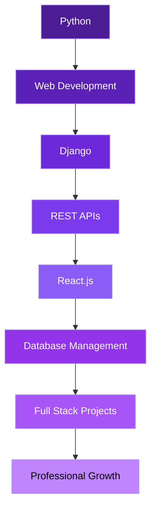

<div align="center">


<br/>


<br/><br/>


<br/><br/>

<a href="https://linkedin.com/in/syedthamees2743">

</a>
<a href="mailto:thameessyed2743@gmail.com">

</a>
<a href="https://syedthamees.netlify.app">

</a>

<br/><br/>


</div>


## 🧑‍💻 About Me

```yaml
name: Syed Thameesudeen
education: B.E. Computer Science
role: Python Django Full Stack Developer
current_role: Python Full Stack Intern @ Futura Lab

focus:
  - Python
  - Django
  - Django REST Framework
  - React.js
  - PostgreSQL

mindset:
  Learn → Build → Improve
```

I am a **Python Django Full Stack Developer** passionate about building responsive and real-world web applications.

Currently working as a **Python Full Stack Intern at Futura Lab**, gaining hands-on experience in Django, REST API development, React.js, PostgreSQL, authentication, and full-stack application development.

<br/>

## ⚡ Tech Stack

<div align="center">

**Programming Languages**


<br/><br/>

**Frontend**


<br/><br/>

**Backend**


<br/><br/>

**Database**


<br/><br/>

**Tools & Platforms**


</div>

<br/>

## 📊 GitHub Stats

<div align="center">


<br/>


<br/><br/>


</div>

<br/>

## 🚀 Featured Projects

<table>
<tr>
<td width="50%" valign="top">

### 🛠️ Smart IT Service Desk

A **Django Full Stack IT Service Desk and Asset Management System** with role-based access and complete ticket management workflow.

**Highlights**
- JWT Authentication
- Admin, Employee & Technician Roles
- Ticket Creation & Assignment
- SLA Tracking & Status Management
- IT Asset Management
- Email Notifications
- FAQ / Knowledge Base
- Dashboard Analytics
- PDF Reports
- React + Django REST API Integration

`Python` `Django` `DRF` `React.js` `PostgreSQL` `JWT` `Axios` `Bootstrap`

</td>
<td width="50%" valign="top">

### 🚆 Railway Reservation System

A **Django Full Stack Railway Reservation Web Application** for searching trains and managing ticket reservations.

**Highlights**
- User Registration & Login
- Train Search
- Ticket Booking
- Seat Reservation
- Ticket Cancellation
- Django ORM
- Responsive UI

`Python` `Django` `SQLite` `HTML5` `CSS3` `Bootstrap` `JavaScript`

</td>
</tr>
<tr>
<td width="50%" valign="top">

### 📈 Stock Market Prediction & Tracker

An academic project focused on visualizing stock trends, charts, and prediction results through an interactive dashboard.

**Highlights**
- Stock Trend Visualization
- Interactive Dashboard
- Charts & Prediction Results
- React.js Frontend
- Python-based Prediction Model

`Python` `React.js` `JavaScript` `HTML5` `CSS3`

</td>
<td width="50%" valign="top">

### ✨ More Coming Soon

Actively building new full stack projects with Django, DRF, and React.

Stay tuned — new repositories get added regularly as I keep learning and shipping.

`Python` `Django` `React.js`

</td>
</tr>
</table>

<br/>

## 🧭 My Learning Journey

<div align="center">



> **Learn → Build → Improve**

</div>

<br/>

## 🎯 Current Focus

```yaml
learning:
  - Advanced Django
  - Django REST Framework
  - React.js
  - PostgreSQL

building:
  - Full Stack Web Applications
  - REST API Based Applications

exploring:
  - JWT Authentication
  - Role-Based Access Control
  - Scalable Backend Development

goal:
  - Become a Strong Python Full Stack Developer
  - Build Real-world Applications
```

<br/>

## 🐍 Contribution Snake

<div align="center">

</div>

> Add the [GitHub Contribution Snake action](https://github.com/Platane/snk) to your repo to auto-generate this animation.

<br/>

## 🤝 Connect With Me

<div align="center">

<a href="https://linkedin.com/in/syedthamees2743">

</a>
<a href="mailto:thameessyed2743@gmail.com">

</a>
<a href="https://syedthamees.netlify.app">

</a>

<br/><br/>


</div>

<br/>

<div align="center">

### 💜 Keep Building. Keep Learning. Keep Growing.


<br/><br/>


</div>
